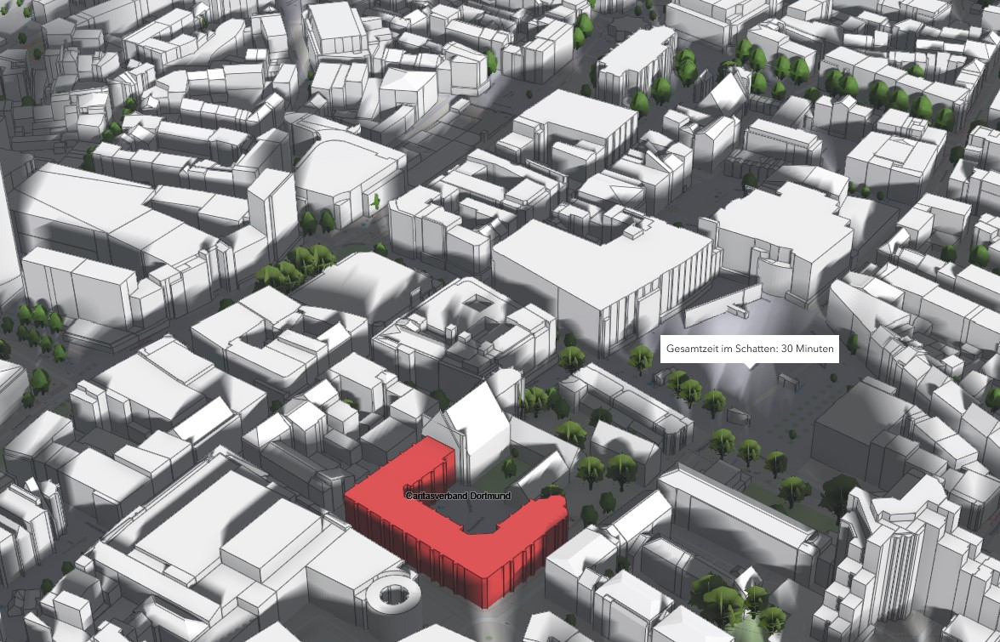

.. shademap-readthedocs documentation master file, created by
   sphinx-quickstart on Tue Feb 18 12:45:49 2025.
   You can adapt this file completely to your liking, but it should at least
   contain the root `toctree` directive.

Welcome to the shademap-readthedocs documentation!
==================================================

This is a start to finish **tutorial**, to *reproduce* the `3D shademap <https://shadowmap.catch4d.de/iframe.html>`_. 

.. note::
   This documentation is under active development.

Add your content using ``reStructuredText`` syntax. See the
`reStructuredText <https://www.sphinx-doc.org/en/master/usage/restructuredtext/index.html>`_
documentation for details.

.. toctree::
   :maxdepth: 4
   :caption: Table of Contents
   

   Introduction
   Getting_Started
   mandatory_installations
   Data_preparation

   